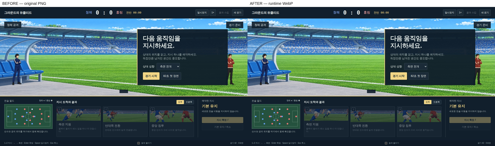
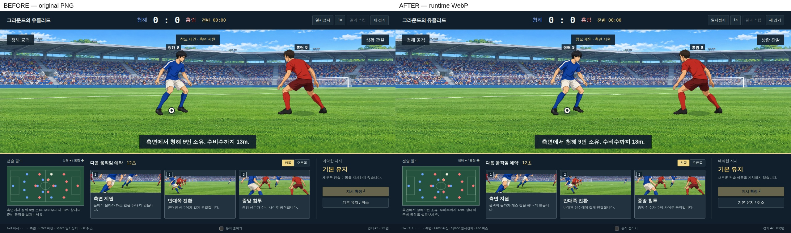
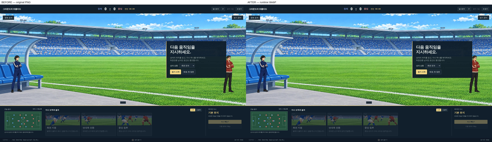
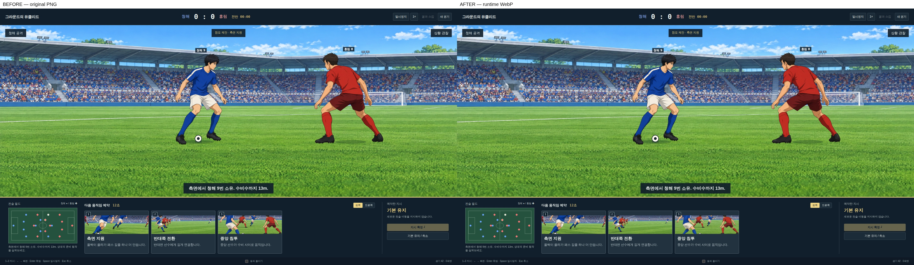

# Director 이미지와 카드 요청 검증

기준은 main `67a077659455d7dd5fd4580e04425d98f015ba9e`, 변경본은 `14c04d05e731913abb0874ccdcdf6a1411633e04`이다. 변경본 뒤의 이 폴더 추가는 런타임 코드·이미지를 바꾸지 않는다.

`tools/serve.py`의 기본 `Cache-Control: no-store`를 유지한 채 Chromium에서 측정했다. 각 해상도는 새 브라우저 컨텍스트, DPR 1, 빈 localStorage로 열었다. 첫 렌더의 카드 그림과 씬 로더의 이미지 요청이 완료된 시점의 이미지 응답 `Content-Length`를 합산했다. 헤더·스크립트·JSON은 이 합계에 포함하지 않는다.

| 확인 | 1280×720 변경 전 → 후 | 1920×1080 변경 전 → 후 |
|---|---|---|
| 첫 로드 이미지 | 74,815,560 → 7,705,006 bytes | 74,815,560 → 7,705,006 bytes |
| 첫 로드 이미지 MiB | 71.35 → 7.35 | 71.35 → 7.35 |
| 첫 로드 이미지 요청 | 22 → 25 | 22 → 25 |
| 한 경기 카드 요청 | 39 → 6 | 39 → 6 |
| 네트워크 실패 / pageerror | 0 / 0 → 0 / 0 | 0 / 0 → 0 / 0 |

시드 42, 기본 유지, 4×, COMMAND 즉시 확정·PRESENT 스킵으로 26국면과 전후반을 끝까지 진행했다. 변경 전후 모두 결과 0:0이다. 애니메이션 루프에는 0.1초 단위로 시간을 전달했으며 게임 규칙은 바꾸지 않았다. 카드 요청은 첫 화면부터 종료까지 누적했다. 변경 후에는 두 카드 묶음 6장이 처음 한 번만 로드되어 첫 로드가 25장이 된다. 영구 보관된 버튼을 숨기거나 보여 주므로 서버 캐시를 켜지 않아도 추가 카드 요청이 없다.

원시 응답 기록: [변경 전](before-network.json), [변경 후](after-network.json).

공격과 수비 fixture에서 DOM 버튼 6개·보이는 버튼 3개를 확인하고 `1` 키가 각각 측면 지원·측면 압박을 예약하는지 검사했다. `stadium-goal.webp`를 404로 바꾸어 누락 안내와 경기 진행을 확인했다. `card-support.webp`를 404로 바꾸어 카드의 그림이 기본 기호로 대체되고 숫자 단축키가 계속 작동하는 것도 확인했다. `director-lab.html`과 제작 시안 `preview.html`은 네트워크 실패·pageerror 0건이었다.

원본 PNG 25장은 편집·출처 확인용으로 보존했다. 런타임은 manifest의 WebP 경로만 사용한다. 시안 폴더의 중복 PNG 6개는 보존 원본과 바이트 단위로 동일함을 확인한 뒤 제거했다. git 이력과 `assets/director/` 원본으로 복구할 수 있다. 새 이미지 생성·저장소 의존성 추가·서버 캐시 정책 변경은 없다.

## 화질 비교

시드 42의 READY와 첫 FLOW, 동일 해상도·DPR·스크롤 위치에서 캡처했다. 왼쪽은 원본 PNG, 오른쪽은 WebP다. JPG는 검토용 캡처만 압축한 것이며 게임의 인물·카드 WebP 인코딩은 lossless다. 관중석·잔디의 미세 무늬에는 축소·배경 압축 차이가 있다. 눈에 띄는 윤곽 손상은 관찰하지 못했지만 최종 화질 판정은 사람이 한다.

